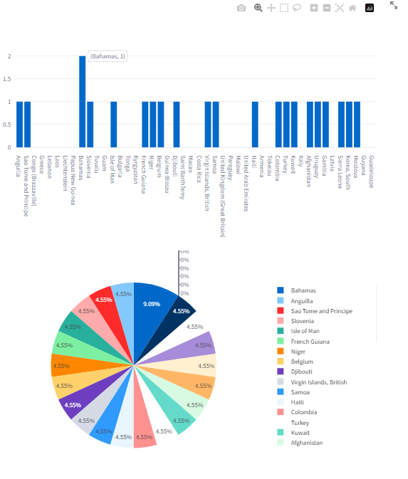

# 사용자가 지정한 csv 파일 분석
# 프로잭트 소개:

사용자가 CSV 파일을 업로드하면 해당 파일을 데이터프레임으로 읽어와서 상관관계 분석, 통계 및 시각화를 수행합니다.

링크 : http://ec2-13-124-63-236.ap-northeast-2.compute.amazonaws.com:8505/

## 사용 라이브러리

streamlit, pandas, seaborn, matplotlib.pyplot, numpy, plotly.graph_objects, plotly, random

## 기능

파일 업로드: 사용자는 CSV 파일을 업로드하여 데이터를 시각화할 수 있습니다.

통계: 업로드된 데이터에 대한 통계 정보를 확인할 수 있습니다.

데이터 시각화: 선택한 컬럼에 대한 상관관계, 히스토그램, 박스 플롯 등 다양한 차트를 생성할 수 
있습니다.

  

정렬 및 필터링: 데이터를 정렬하고 필요한 만큼의 데이터만 시각화할 수 있습니다.

   

문자 및 숫자 데이터 비교: 문자 끼리의 데이터와 숫자 끼리의 데이터를 비교하여 차트를 생성할 수 있습니다.

   

## 배포

작성한 코드 Gitgub 에 업로드합니다.

AWS EC2 활용했습니다.

PuTTY를 사용하여 EC2 인스턴스에 연결합니다.

Linux 환경에서 Gitgub에 코드를 clone 하여 가지고옵니다.

백그라운드로 서버를 실행하여 로컬에서 PUTTY를 종료해도 서버가 유지되게 했습니다.

## 배포자동화

github action을 활용하여 코드를 수정해서 github에 업로드 하면 자동으로 Linux에서 git pull 할 수 있게 했습니다.

 